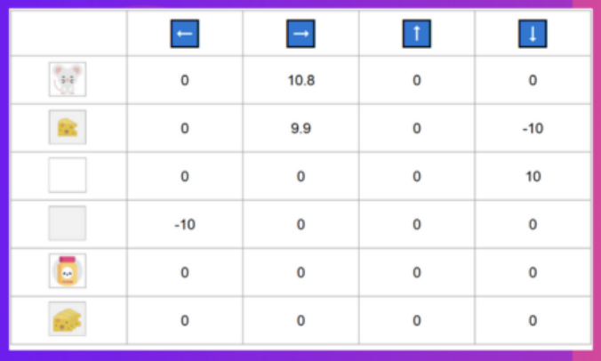

<!-- _class: title -->

# Deep Q Reinforcement Learning

## WIP: Pattern Stacking in Modern Tetris

- Ya boi Brom
- (Not an ML expert)

---

# Modern Tetris?

- Bag Randomizer
- Hold
- 3-5 Pieces visible in queue
- Rotation Systems (SRS, ...)
- Kicks and Spins: T-Spins

<!-- _footer: 'Screenshot from: https://tetr.io' -->

---

# Pattern Stacking: LST

- stacking predefined patterns
- e.g. LST, ST, Mechanical TSD, ...
- LST:
  - T-Spins
  - repeating LS pattern

<!-- _footer: 'Source: [https://four.lol](https://four.lol/stacking/lst)' -->

---

# Reinforcement Learning

- No training data required
- Agent
  - acts in an Environment
  - learns through interaction with Environment
- State
- Action
- Reward

<!-- _footer: 'Source: [https://huggingface.co](https://huggingface.co/learn/deep-rl-course/unit2/q-learning-example)' -->

---

# Q Learning

- Trains the Q-Function:
  - $Q(S, A) \mapsto V$
- Based on a **Q-Table**:
  - accumulates reward over time (DP)
  - initialized with 0
- Learn optimal action for given state
- Epsilon Greedy Strategy
- Discount Factor (gamma)

<!-- _footer: 'Source: [https://huggingface.co](https://huggingface.co/learn/deep-rl-course/unit2/q-learning-example)' -->

---

# Q Learning

- Trains the Q-Function:
  - $Q(S, A) \mapsto V$
- Based on a Q-Table:
  - accumulates reward over time (DP)
  - initialized with 0
- Learn optimal action for given state
- **Epsilon Greedy Strategy**
- Discount Factor (gamma)

<!-- _footer: 'Source: [https://researchgate.net](https://www.researchgate.net/figure/Epsilon-greedy-method-At-each-step-a-random-number-is-generated-by-the-model-If-the_fig2_334741451)' -->

---

# Deep Q Reinforcement Learning

- Based on Q-learning
- Deep NN learns Q-Table
- Predicts best action given a state

---

# Inspiration

- https://github.com/uvipen/Tetris-deep-Q-learning-pytorch
- Learns to simply clear lines and stay alive
- Boiled down state
  - lines cleared, holes, bumpiness, height
- Simple Fully Connected Network Architecture

---

# Goals

- Learn from environment only
- Pattern Stack LST (maybe others)
- Discovery of stacking techniques
  - STSD, right side shape, double-up, ...

<!-- _footer: 'Source: [https://four.lol](https://four.lol/methods/stsd)' -->

---

# Goals for now

- for the love of god please score a couple lines
- for the love of god please score a couple lines
- for the love of god please score a couple lines
- for the love of god please score a couple lines

---

# Walk through the Implementation

- Network Architecture
- States, Actions, Reward
- Epsilon Greedy Strategy
- Experience Replay

---

# Aside: Working with Python

- Use [poetry](https://python-poetry.org/).
- wraps virtualenv _(think nvm)_
- wraps pip _(think npm)_

---

# Work in Progress

- Fully Connected
- Going deep and wide
- Scoring Functions
- Changing Learning Rates
- Changing discount factor (gamma)
- Convolutional
- Convolutional -> Fully Connected

---

# Further Ideas

- Scoring Function
- Different Episolon Greedy Strategy
- Transfer Learning
- Different Error function
- NEAT

---

# Closing Thoughts

- Code is running
- Journey just began
- Will it ever learn?
