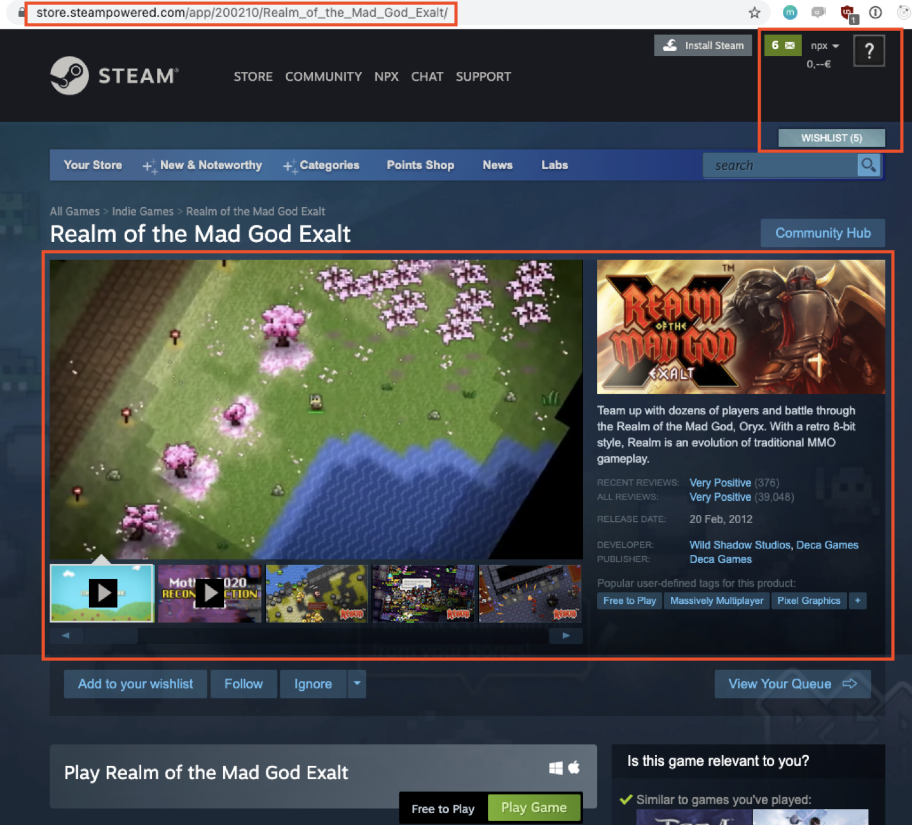

<!-- _class: title -->

# @ngrx/signals

## Managing state on component level

- Yannick Baron
- @yannick_baron
- Software Architecture Consultant

---

# Reactive Applications react to

- user interaction
  - clicks, hover, inputs, ...
- data changes
  - receiving data (e.g. http)
  - continuous data updates (e.g. websockets)
- state changes
  - form value changes (e.g. checkbox)
  - collapsible component
  - settings changes

---

# What/where is state?

- router state
  - which route is active
  - router params / query params
- application state
  - active user
  - wishlist items / notifications
- component state
  - game details
  - selected video
  - video playing?

---

# Common concepts in advanced reactive Angular

- subject in a service
- combining streams to deliver view model
- subscribing via async pipe
- OnPush change detection + immutability

1. performance boost
   - more control over change detection
2. no unforeseen side effects
   - by updating state from different sources

---

# Downsides of RxJS (for template rendering)

- Observables asynchronous by default
- AsyncPipe default null value
- Subscription management
- Recheck all template bindings
- No reactive inputs

---

# Enter Signals

- Reactive primitive
- Hold value, notify when value changes
- Integrated with Angular

1. Results in knowing **exactly** which **nodes** need updating

---

# Why @ngrx/signals?

- signal based state management on component level
- conveniently handle multiple signals
- brings rxjs interop to manage user interaction gracefully
- brings entity management out of the box
- extensible API through store features
- functional principles

---

# @ngrx/signals: Whats in it?

- signalState
  - small scale simple state management
- signalStore
  - elaborate state management including logic
- patchState
  - method to transition between states
- rxMethod
  - RxJS based callable methods (ComponentStore effects)
- store features
  - extend the base store with recurring features

---

<!-- _class: section-slide -->

# Code with me?

https://github.com/thinktecture/ngrx-demo

Branch: code-with-me/signal-store

<!--

* implement signalStore in TodoListStore
* withState
* withComputed
* withMethods:
  - editing
  - async addItem
  - outsource loadingStart and loadingDone
  - make them patchers
  - async updateItem
* rxMethod: loadList
* withEntities

* custom feature: withSort

* signalState: in the counter example

* storify: TodoService
  - provide in root
  - multiple collections

-->

---

<!-- _class: section-slide -->

# Thank You!

## https://www.thinktecture.com/thinktects/yannick-baron

<!--
# Notes

- patchState

  - simple patch
  - updater functions
  - show multiple updater patches

- rxMethod

  - use store functions inside of rxMethod
  - pipe() obsolete when only 1 operator
  - subscribing to source stream directly
  - with and without store

- Entity Management (withEntities)

  - show multiple collections
  - show how entity adapter can be used [???]

- custom features

  - build sort feature

---

TODO
[x] clean out code with me for signal-store
[ ] signalState example
[x] signal store slides

[ ] signal store webinar

[ ] blog post signal store?

-->
